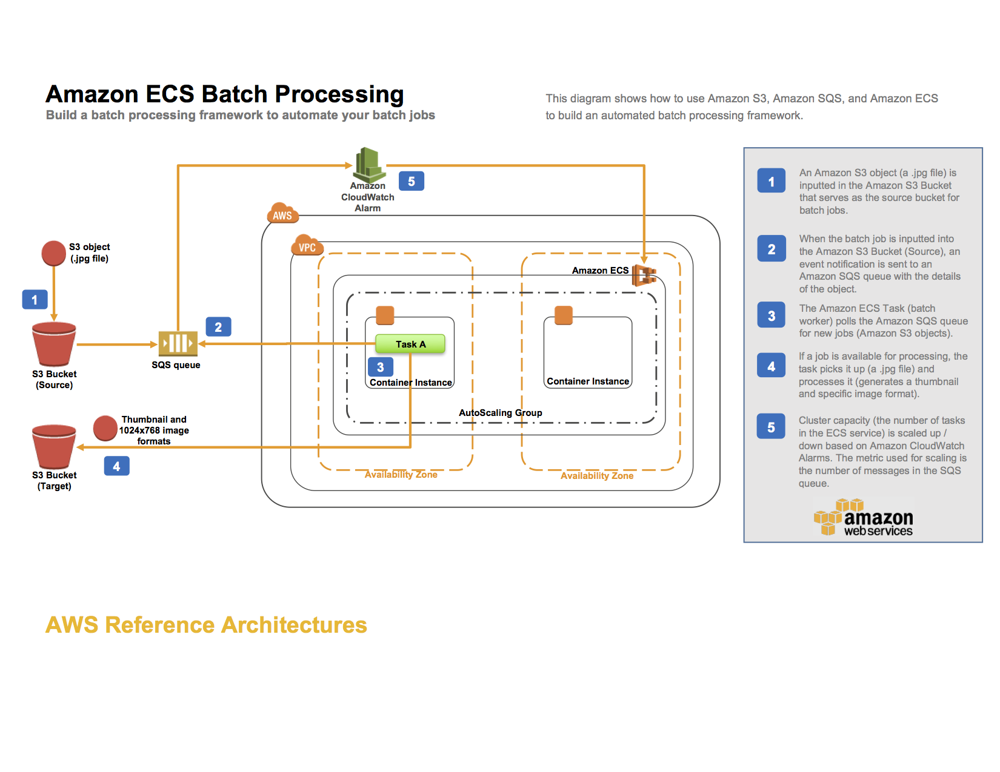
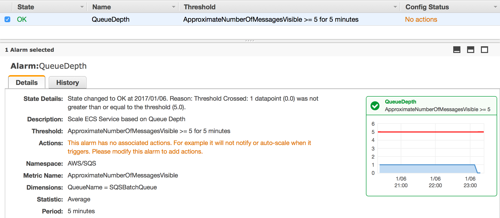
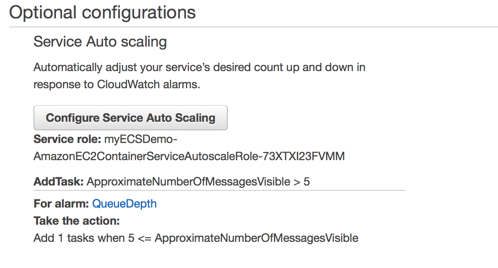

# Amazon ECS Reference Architecture: Batch Processing

This reference architecture shows how to handle Batch Processing using [Amazon ECS](http://aws.amazon.com/ecs). You may also want to consider [AWS Batch](https://aws.amazon.com/batch), a service that dynamically provisions the optimal quantity and type of compute resources based on the volume and specific resource requirements of the batch jobs submitted. The Batch Processing reference architecture diagram below illustrates the architecture.

The [AWS CloudFormation](https://aws.amazon.com/cloudformation) template included in this example creates an input and an output [Amazon S3](https://aws.amazon.com/s3) bucket, an [Amazon SQS](https://aws.amazon.com/sqs/) queue, an [Amazon CloudWatch](https://aws.amazon.com/cloudwatch/) alarm, an [ECS](https://aws.amazon.com/ecs/) cluster, and an ECS task definition. Objects uploaded to the input S3 bucket trigger an event that sends object details to the SQS queue. The ECS task deploys a Docker container that reads from that queue, parses the message containing the object name and then downloads the object. Once transformed it will upload the objects to S3 output bucket.

By using the SQS queue as the location for all object details, we can take advantage of it's scalability and reliability as the queue will automatically scale based on the incoming messages and message retention can be configured. The ECS Cluster will then be able to scale services up or down based on the number of messages in the queue. This example template uses images, in jpg format, to showcase the batch workload ECS architecture. Upload images with a .jpg suffix to the input S3 bucket to trigger the event. NOTE: Use the lowercase .jpg suffix.

The CloudFormation template creates an [IAM role](http://docs.aws.amazon.com/AmazonECS/latest/developerguide/task-iam-roles.html) that the ECS task assumes in order to get access to the S3 buckets and SQS queue. Note that the permissions of the IAM role doesn't specify the S3 bucket ARN for the incoming bucket. This is to avoid a circular dependency issue in the CloudFormation template. In a real-world scenario, you should always make sure to assign the least amount of privileges needed to an IAM role.

## Running the example
Follow these steps to run the template.

###Step 1: Clone the Github repository and build the Docker image
To run the entire example, first clone the source repository, using the following command:

  `$ git clone https://github.com/awslabs/ecs-refarch-batch-processing.git`

Build and push the Docker image to a Docker registry (such as Docker Hub):

  `$ cd ecs-refarch-batch-processing/docker`

Make sure to log in with your Docker Hub account credentials:

  `$ docker login`

Build the Docker image:

  `$ docker build -t <repo>/<image> .`

Push the image:

  `$ docker push`

###Step 2: Create a CloudFormation stack
Choose **Launch Stack** to launch the template in the us-east-1 region in your account:

The CloudFormation template requires the following parameters:

- **DesiredCapacity** : The number of desired instances in the AutoScaling Group and ECS Cluster
- **DockerImage** : The Docker repository and image file to deploy as part of the ECS task. Choose the docker image that you created in Step 1, in the form repo/image
- **InstanceType** : The EC2 instance type
- **KeyName** : The name of an existing EC2 key pair to enable SSH access to the ECS instances
- **MaxSize** : The maximum number of instances in the AutoScaling Group and ECS Cluster
- **SSHLocation** : The IP address range that can be used to SSH into the EC2 instances
- **Subnets** : The subnets used for the Auto Scaling group
- **VpcId** : The VPC to use for the ECS cluster

###Step 3: Create the S3 event trigger for the SQS queue
Go to the S3 Console in your AWS Account and select the S3 Input Bucket that the CloudFormation template created and go to Properties -> Events.

Configure an event notification to the SQS queue called SQSBatchQueue for the ObjectCreated (All) event and in the Suffix field enter "jpg".

You can learn more about configuring S3 event notifications [here](http://docs.aws.amazon.com/AmazonS3/latest/dev/NotificationHowTo.html).

###Step 4: Create the ECS Service
Go to the ECS Console in your AWS Account and [create an ECS Service](http://docs.aws.amazon.com/AmazonECS/latest/developerguide/create-service.html) choosing the ECS Cluster and Task definition created by the CloudFormation template. Give the service a name and set the number of desired tasks to deploy as part of the service. For this example, you can configure the basic service parameters.

###Step 5: Update the ECS Service to configure Auto Scaling
In this step you will [configure auto scaling](http://docs.aws.amazon.com/AmazonECS/latest/developerguide/create-service.html#service-configure-auto-scaling) for the service you created in step 4.
[CloudWatch](https://aws.amazon.com/cloudwatch/) allows you to trigger alarms when a threshold is met for a metric. The CloudFormation template creates a CloudWatch Alarm for the SQS queue on the ApproximateNumberOfMessagesVisible metric so that when the number of messages exceeds a specified limit over a specified time period, the ECS Service will launch an additional task on the ECS Cluster. Use this existing alarm when configuring the scaling for the service.

Select the service created in Step 4 and click Update, then "Configure Service Auto Scaling". Choose "Configure Service Auto Scaling to adjust your service’s desired count" and fill in the minimum, desired and maximum number of tasks. Click on "Add a scaling policy" and use the existing alarm (created by the CloudFormation template).

The CloudWatch alarm created by the template should now look similar to this.

Your service configuration should look similar to this.

## Testing the example
Once you have completed the above steps, you can test the example as follows:

1. Upload one or more .jpg files into your S3 input bucket (lowercase .jpg suffix).
2. Explore the output files in the S3 output bucket.

## Cleaning up the example resources

To remove all resources created by this example, do the following:

1. Delete the created output and input S3 buckets.
2. Delete the CloudFormation stack.
3. Delete the ECS cluster.
4. Delete the EC2 Role.

## CloudFormation template resources
The following sections explain all of the resources created by the CloudFormation template provided with this example.

- **myS3InputBucket** - An S3 bucket where objects (images with a .jpg suffix) can be uploaded to trigger the resize.

- **myS3OutputBucket** - An S3 bucket where resized objects are stored with keys thumbs/ and resized/.

- **SQSQueue** - A SQS queue that holds messages containing the name of the uploaded object.

- **SQSDeadLetterQueue** - A SQS dead letter queue for messages that was unsuccessfully handled.

- **ECSCluster** - An ECS cluster.

- **SQSCloudWatchAlarm** - A CloudWatch Alarm for the SQS queue for the ApproximateNumberOfMessagesVisible metric.

- **ECSAutoScalingGroup** - An Auto Scaling group used to create your instances.

- **InstanceSecurityGroup** - Security Group to which your instances are added.

- **TaskDefinition** - An ECS task definition that is started by the ECS service. The ECS task schedules a Docker container that copies the uploaded object and creates a thumbnail and a resized (1024x768) image file in the output S3 bucket.

- **ECSServiceRole** -  An IAM role assumed by the ECS service, which gives the service the right to register instances to an Elastic Load Balancer if needed.

- **EC2Role** - An IAM role assumed by the EC2 instances, which gives them the right to register themselves with the ECS services.

- **ECSTaskRole** - An IAM role assumed by the ECS task. This role gives the Docker container the right to upload and fetch objects to and from S3 as well as read and delete messages from the SQS queue. By using an ECS task role, the underlying EC2 instances do not need to be given access rights to the resources that the container uses. For more information about IAM roles for tasks, see [IAM Roles for Tasks](http://docs.aws.amazon.com/AmazonECS/latest/developerguide/task-iam-roles.html).

##License
This reference architecture sample is licensed under the Apache License, Version 2.0 (the "License"); you may not use this file except in compliance with the License. You may obtain a copy of the License at [http://www.apache.org/licenses/LICENSE-2.0](http://www.apache.org/licenses/LICENSE-2.0).
